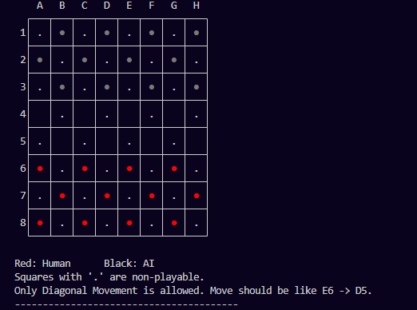

# Checkers (Draughts) Game with AI

**Author:** Husnain Maroof  
**Role:** ML Engineer  
**Date:** 12 September, 2025  

This project implements the classic **Checkers (Draughts)** board game in Python with an **AI opponent**.  
The game runs in the **terminal** and allows a human player to compete against a computer that uses **Minimax with Alpha–Beta pruning** for decision making.

---

# Overview

Checkers is a two-player strategy board game played on an **8×8 board** where pieces move diagonally and capture opponent pieces by jumping over them.
## Preview



In this implementation:

- **Human player controls Red pieces (R)**
- **AI controls Black pieces (B)**

The game includes full rule handling such as:

- Mandatory captures
- Multi-capture chains
- King promotion
- Win and draw detection

---

# Features

- Complete **Checkers rule implementation**
- **Human vs AI gameplay**
- **Minimax algorithm with Alpha–Beta pruning**
- **Adaptive search depth** depending on game stage
- Intelligent **board evaluation heuristics**
- Multi-capture support
- King promotion
- Colored terminal board with Unicode pieces

---

# Game Symbols

| Symbol | Meaning |
|------|------|
| **● (Red)** | Human piece |
| **● (Black)** | AI piece |
| **♔** | King |
| **-** | Playable square |
| **.** | Non-playable square |

---

# How Moves Work

Moves are entered using board coordinates.
E6 -> D5

Meaning: move the piece from **E6** to **D5**.

Rules enforced by the program:

- Diagonal movement only
- Captures are mandatory
- Multiple captures allowed in one turn
- Pieces become **Kings** when reaching the opposite end

---

# AI System

The AI uses **Minimax search with Alpha–Beta pruning** to evaluate future board states.

### AI Features

- Adaptive search depth
- Board evaluation heuristics
- Capture prioritization
- King safety and mobility analysis
- Threat detection and avoidance

The AI evaluates positions based on:

- Piece count
- King value
- Board control
- Mobility
- Capture opportunities
- Safety from opponent captures

---

# How to Run

Clone the repository:

```bash
git clone https://github.com/husnainalix77 /HusnainPythonPortfolio.git
