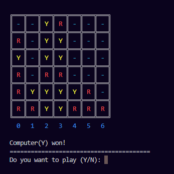

# Connect Four Game – Human vs Strong AI

**Coded & Documented by Husnain Maroof – 08 Sep, 2025**

A fully playable **Connect Four game** implemented in Python with a **strong AI opponent**. The AI uses strategic decision-making to win when possible, block the opponent, and select strong board positions. The game runs in the **terminal/console** and displays the board using a **Unicode grid with colored pieces**.

## Preview


---

## Overview

**Connect Four** is a classic two-player strategy game played on a vertical grid. Players take turns dropping colored discs into columns, and the disc falls to the lowest available space. The objective is to be the **first player to connect four pieces** in a row horizontally, vertically, or diagonally.

In this implementation:

- **Human player uses Red (R)**
- **Computer AI uses Yellow (Y)**

---

## Features

- Human vs Computer gameplay  
- Strong AI opponent with strategic logic  
- Unicode-based grid display in the terminal  
- Colored pieces for better visualization  
- Automatic win detection (horizontal, vertical, diagonal)  
- Column validation to prevent invalid moves  
- Cross-platform screen clearing (Windows / Linux / macOS)  
- Standard **6 × 7 Connect Four board**

---

## Controls

When prompted, enter the **column number** where you want to drop your piece.


Valid columns range from **0 to 6**.

---

## Gameplay Instructions

1. Start the program.
2. Choose whether to **play first or second**.
3. Enter a **column number (0–6)** to place your piece.
4. The piece will automatically fall to the lowest empty slot in that column.
5. Players alternate turns.
6. The game ends when:
   - A player connects **four pieces in a row**, or
   - The board becomes full.

---

## AI Strategy

The computer opponent follows a multi-step decision process:

1. **Immediate Win:** If the AI can win in the current move, it takes that move.
2. **Block Opponent:** If the human can win on the next move, the AI blocks it.
3. **Center Preference:** The AI prefers the center column for stronger board control.
4. **Safe Moves:** Avoids moves that would allow the opponent to win immediately.
5. **Fallback:** If no strategic move is found, a random valid column is selected.

---

## Dependencies

This project only uses built-in Python libraries:

- `random`
- `time`
- `os`
- `platform`

No external packages are required.

---

## How to Run

1. Clone the repository:

```bash
git clone https://github.com/husnainalix77/HusnainPythonPortfolio.git
