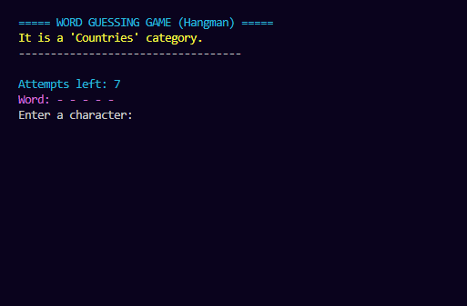

# Hangman (Word Guessing Game)

**Coded by Husnain Maroof – August 2025**

A console-based **Hangman (Word Guessing Game)** implemented in Python.  
The player guesses letters to reveal a hidden word chosen from different categories such as **Countries, Animals, and Fruits**. The game provides colored terminal feedback, tracks guessed letters, and limits the number of attempts.

---
## Preview

## Overview

Hangman is a classic word-guessing game where the player attempts to discover a hidden word by guessing letters one at a time. If the guessed letter exists in the word, it is revealed in its correct position(s). If the guess is incorrect, the number of remaining attempts decreases.

In this implementation:

- Words are randomly selected from predefined **categories**
- The player receives **attempts based on word length**
- The game tracks **previous guesses**
- Colored text improves **terminal readability**

---

## Features

- Random word selection from multiple categories  
- Categories include **Countries, Animals, and Fruits**  
- Colored terminal output for better user experience  
- Input validation for guesses  
- Displays guessed letters history  
- Dynamic attempt count based on word length  
- Option to **play multiple rounds**

---

## Gameplay Instructions

1. Run the program.
2. The game randomly selects a category and a hidden word.
3. The player guesses **one letter at a time**.
4. If the guessed letter exists in the word, it appears in its correct position.
5. If the guess is incorrect, the number of remaining attempts decreases.
6. The game ends when:
   - The player **guesses the entire word**, or
   - The player **runs out of attempts**.

---


---

## Dependencies

The program only uses Python built-in libraries:

- `random`

No external packages are required.

---

## How to Run

1. Clone the repository:

```bash
git clone https://github.com/husnainalix77/HusnainPythonPortfolio.git
