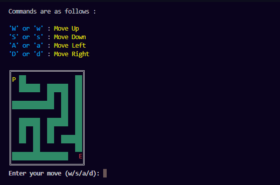

# Maze Game (DFS Maze Generator)

**Author:** Husnain Maroof  
**Date:** 11 October, 2025  

This project implements a **terminal-based maze game in Python** where a player navigates through a randomly generated maze to reach the exit.

The maze is generated using a **Depth-First Search (DFS) algorithm**, ensuring that every maze created is **solvable**. The player moves through the maze using keyboard commands until they reach the exit.

---

# Project Overview

This program creates a **random maze of variable size** and allows the player to navigate from the **start position** to the **exit**.

Maze sizes supported:

- Beginner → **5 × 5**
- Medium → **8 × 8**
- Advanced → **10 × 10**

Each maze is generated dynamically using a **recursive DFS path-carving algorithm**, producing a different maze every time the game runs.

---
## Preview

# Features

- Random maze generation
- Guaranteed solvable maze
- Multiple difficulty levels
- Terminal-based graphical display
- Colored maze elements using `colorama`
- Player movement using keyboard commands
- Time tracking to measure how long the player takes to solve the maze
- Object-Oriented design using a `Maze` class

---

# Maze Symbols

| Symbol | Meaning |
|------|------|
| **P** | Player |
| **S** | Start position |
| **E** | Exit |
| **██** | Wall |
| empty space | Path |

The maze is displayed inside a **Unicode box frame** for better visualization.

---

# Controls

| Key | Action |
|----|----|
| **W** | Move Up |
| **S** | Move Down |
| **A** | Move Left |
| **D** | Move Right |


---

# Algorithm Used

## Depth-First Search (DFS) Maze Generation

The maze is generated using **recursive depth-first search**.

### Steps

1. Start from the **top-left cell (0,0)**.
2. Mark the current cell as visited.
3. Randomly shuffle directions.
4. Move two cells in a chosen direction.
5. If the cell has not been visited:
   - Carve a path between the cells
   - Continue DFS from the new cell.
6. Repeat until all reachable cells are visited.

This ensures the maze has:

- No isolated sections
- At least one valid path from **Start → Exit**

---

# Game Flow

1. User selects difficulty level.
2. Maze is generated using DFS.
3. Player starts at **S (Start)**.
4. Player navigates using **W, A, S, D**.
5. Game ends when player reaches **E (Exit)**.
6. Total time taken to solve the maze is displayed.

---


---

# Technologies Used

- Python
- Object-Oriented Programming (OOP)
- Depth-First Search (DFS)
- Randomized algorithms
- Terminal UI
- Colorama for colored output

---

# How to Run

Clone the repository:

```bash
git clone https://github.com/husnainalix77/HusnainPythonPortfolio.git

