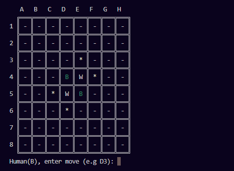

# Reversi (Othello) Game – Human vs AI

**Coded and Edited by Husnain Maroof – 9 Sep, 2025**
## Preview


A fully playable **Reversi (Othello) game** in Python with an AI opponent powered by **Minimax algorithm with alpha-beta pruning**. This project includes a dynamic board evaluation strategy, highlighting valid moves, and an adaptive AI depth depending on the stage of the game.

---

## Table of Contents

- [Overview](#overview)  
- [Features](#features)  
- [Gameplay Instructions](#gameplay-instructions)  
- [AI Details](#ai-details)  
- [Dependencies](#dependencies)  
- [How to Run](#how-to-run)  
- [License](#license)  

---

## Overview

Reversi (Othello) is a classic strategy board game played on an NxN board (default 8x8) where two players (Black and White) take turns placing pieces to capture opponent pieces. The player with the most pieces on the board at the end of the game wins.

This implementation allows:  
- Human vs Computer gameplay  
- Real-time highlighting of valid moves  
- AI that considers piece count, mobility, corners, and edges  
- Adaptive search depth for optimal performance  

---

## Features

- **Dynamic Board Size:** Default 8x8 but can be modified.  
- **Human vs AI:** Human plays Black (`B`), Computer plays White (`W`).  
- **Valid Move Highlighting:** Shows `*` for all valid moves for the human player.  
- **Adaptive AI Depth:** AI searches deeper in the endgame for optimal strategy.  
- **Board Evaluation:** Considers:
  - Piece count  
  - Available moves (mobility)  
  - Corner and edge control  
  - Dangerous squares adjacent to corners  
- **Minimax with Alpha-Beta Pruning:** Efficient AI computation.  
- **Clear Console Display:** Board uses Unicode grid formatting and color-coded pieces.  

---

## Gameplay Instructions

1. Launch the Python script.  
2. Black (`B`) is controlled by the human, White (`W`) by AI.  
3. Column letters and row numbers identify cells (e.g., `D3`).  
4. Input a valid move when prompted. Invalid moves will be rejected.  
5. If a player has no valid moves, their turn is skipped automatically.  
6. Game ends when no valid moves remain or the board is full.  
7. The winner is the player with the most pieces.  

---

## AI Details

The AI uses a **Minimax algorithm** with **alpha-beta pruning** for optimized decision-making.

- **Board Evaluation Function** includes:
  1. **Piece Count:** Maximizes AI pieces over Human.  
  2. **Mobility:** Rewards positions with more available moves.  
  3. **Corner Control:** High-value squares for strategic advantage.  
  4. **Edge Control & Dangerous Squares:** Encourages safe edge placements while avoiding risky positions near corners.  

- **Adaptive Depth:**  
  - Opening phase: depth 4  
  - Midgame: depth 5-6  
  - Endgame: searches entire remaining moves for optimal play  

---

## Dependencies

- Python 3.x  
- Works in Windows console (uses `os.system('cls')`)  
- Optional: ANSI color support for terminal display  

---

## How to Run

1. Clone this repository:  
   ```bash
   git clone https://github.com/husnainalix77/HusnainPythonPortfolio.git
