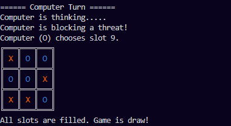

# Tic Tac Toe AI — NxN Board
## Preview


## Overview
An NxN Tic Tac Toe game in Python where a Human plays against an AI opponent.
The AI uses the **Minimax algorithm with Alpha-Beta Pruning** to make intelligent decisions.
The board size is configurable — just change `N` in the main block.

## Files
| File | Description |
|---|---|
| `tic_tac_toe_updated.py` | Complete game with AI logic, OOP design, and colored terminal UI |

## How to Run
```bash
python tic_tac_toe_updated.py
```
> No external libraries required. Python 3.x only.

## Features
- ✅ Configurable NxN board (default 3×3, works for 4×4, 5×5, etc.)
- ✅ Minimax algorithm with Alpha-Beta Pruning
- ✅ Adaptive search depth based on board size
- ✅ Heuristic board evaluation (center, corners, edges, streaks)
- ✅ Immediate win detection and threat blocking
- ✅ Colored terminal display (X in orange, O in blue)
- ✅ Random first-turn selection

## AI Strategy
The AI (`TicTacToeAI`) extends the base `TicTacToe` class and uses:

1. **Win Check** — Plays immediately if it can win
2. **Block Check** — Blocks human's winning move
3. **Minimax + Alpha-Beta** — Searches best move within adaptive depth
4. **Board Heuristic** — Scores based on center control, corners, edges, and near-complete lines

## OOP Design
```
TicTacToe          ← Base class (board setup, display, game loop)
    └── TicTacToeAI  ← Derived class (AI logic, minimax, heuristics)
```

## Concepts Used
- Object-Oriented Programming (Inheritance, Encapsulation)
- Minimax Algorithm with Alpha-Beta Pruning
- Heuristic Evaluation Functions
- Recursive Game Tree Search
- Terminal UI with ANSI color codes

## Author
**Husnain Maroof**  
Mechatronics & Control Engineering, UET Lahore  
GitHub: [husnainalix77](https://github.com/husnainalix77)

September 2025
